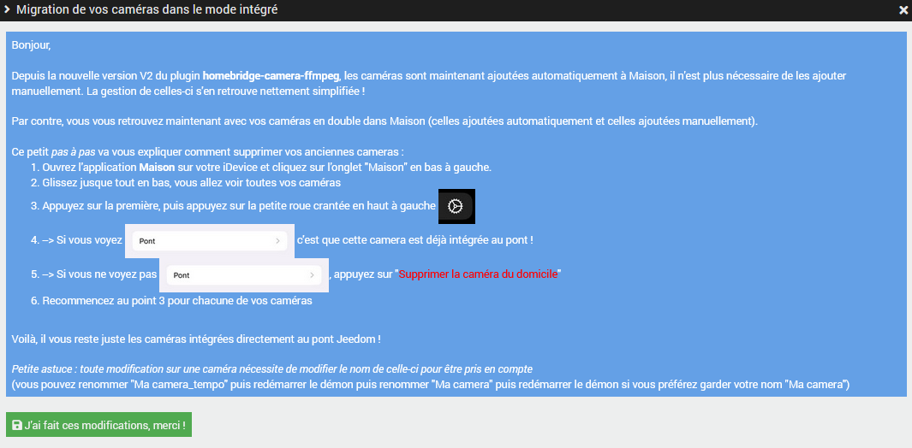

Changelog
=========

A venir prochainement (En Beta)
-------------------------------
* Eclairage adaptatif : tests en cours (car pas possible sur les ampoules qui s'allument lors du changement de la couleur de temperature)
* "Activer la pièce" : est maintenant indépendant de l'app mobile. une pièce activée dans homebridge l'est uniquement pour homebridge !
* Les états définis pour une porte de garage/portail peuvent maintenant être une chaine de caractère.
* Si un état garage/portail a une valeur non définie dans les valeurs configurables, l'état sera "Stoppé en cours d'ouverture". (Pour gérer les garages à pourcentage d'ouverture)
* Meilleure gestion dans le cas d'une alarme sans modes.
* Homebridge 1.3.9
* Correction pour plugin Météo
* Ajout de traductions en_US

17-12-2021
----------

* Si un volet n'as pas d'état et uniquement les boutons Up et/ou Down et/ou Stop, il sera créé des interrupteurs pour ces boutons.
* Fix images en 4.2 + copier coller dans debugInfo
* Compat GenType avec 4.2
* Type générique "Fuite D'eau" passe comme le type générique "Inondation" (c'est un doublon mais bon...)
* Ajout du mode 0 si aucun mode n'a été trouvé pour l'alarme (Maison se comporte mieux en cas d'utilisation non normale des types génériques alarme)
* Ne pas retourner de valeur pour l'alarme si ALARM_ENABLE_STATE = 1 (Maison se comporte mieux en cas d'utilisation non normale des types génériques alarme)
* Etat Volet peut maintenant être un binaire (et Etat Volet Fermeture aussi) et l'invertBinary dans ce cas est supporté aussi.

08-12-2021
----------
* Homebridge 1.3.8
* Homebridge-gsh 2.2.0
* ajout de --allow-releaseinfo-change à apt update pour éviter les erreurs si debian passe d'une release

16-09-2021
----------
* Homebridge-gsh 2.1.0

18-08-2021
----------
* Compatibilité Debian 11 (utilisation de node à la place de nodejs)

17-08-2021
----------
* Homebridge 1.3.4 (en utilisant 'bonjour-hap' à la place de 'ciao' tant que 'ciao' n'est pas au point)
* Support d'un nouveau Type générique spécifique à homebridge "Info/Volet Etat Fermeture (homebridge)" qui gère les Volets qui ont un pourcentage de fermeture (100% = fermé / 0% = ouvert) à la place d'ouverture
* QRcode plus rapide à s'afficher (mise en cache)
* Simplification du code si jeedom >3.2.1 (ce qui sera toujours le cas puisque le plugin requière 3.3.24)
* Gestion multi-interfaces réseau, si c'est le cas (autre que tun), la configuration du plugin laissera le choix de selectionner l'interface sur laquelle publier le mDNS de homebridge (attention aux boucles !!! ne doit être utilisé que si le système fait le pont entre deux réseaux !!!)
* Fix petit bug d'affichage thermostats à la config des modes
* Meilleur affichage en cas d'erreur de code pin dans le plugin
* Augmentation du délais de 3 secondes à 7 secondes lors du check de github

16-03-2021
----------
* Fix pour accessories vide

20-02-2021
----------
* Correction validation JSON en cas de plateformes et accessoires vides
* Désactivation de la correction orthographique sur les textarea des plateformes et accessoires
* Changement du mode d'installation du plugin homebridge-jeedom pour être compatible avec npm 7
* Bloquer homebridge en 1.1.7 tant que 1.3.x n'a pas été testé en beta

08-02-2021
-----------
* Correction pour repasser à Aucun type générique si le type générique est un type (homebridge) sur safari.
* Validateur JSON dans les plateformes et accessoires supplémentaires (obligatoire pour sauvegarder).
* Message dans config.json pour éviter que les utilisateurs le modifient directement et qu'il se retrouve écrasé.
* Cacher le "heartbeat" dans la configuration du plugin, car pas de sens puisque pas d'eqLogic.
* Correction : Thermostat avec seulement une consigne(info+action), garde le thermostat activé

20-01-2021
-------------
* Mise à jour homebridge 1.1.7
* Nouveaux types génériques pour gérer l'inclinaison des volets soit horizontale, soit verticale. (un état et une action)
	* Volet Etat Inclinaison Horizontale (Homebridge)
	* Volet Slider Inclinaison Horizontale (Homebridge)
	* Volet Etat Inclinaison Verticale (Homebridge)
	* Volet Slider Inclinaison Verticale (Homebridge)
* "scheduledBackupDisable" dans config-ui-x, jeedom se charge du backup, pas besoin.
* Meilleur fix pour les problèmes de prefix NodeJS.
* Fix pour problème d'ordre des commandes pour les Volets et Fenêtres automatiques.
* Ajouté le HomePod Mini à la liste des concentrateurs homekit reconnus.
* Fix message d'erreur si google réponds pas pour la création du qrCode.
* Homebridge ne recevra plus les evenements jeedom des commandes appartenant à des équipements non envoyés dans homebridge.
* Meilleure indication de l'utilité de l'équipement camera dans sa pièce. Plus d'affichage du json à cet endroit (utiliser l'import).
* Amélioration DebugInfo pour le cache.
* Correction si Consommation totale (électrique) est en Wh -> convertir en kWh et si la puissance est en kW -> convertir en W
* Correction couleur de lumière, devrait être bcp plus précis (et plus rouge alors que c'était blanc)
* Gestion de l'authentification de Config-UI-X, une fois activé dans la config de homebridge, vous pouvez aller modifier dans Config-UI-X > trois points en haut à droite > Gestion Utilisateurs.  Possible que votre cookie reste valide, déconnectez vous de Config-UI-X (menu trois points) pour vérifier.
* Ajout (?) dans la configuration en plus du tooltip pour donner plus d'informations sur certaines fonctions.
* Meilleur stop du démon plus respectueux, pour laisser le temps à homebridge d'écrire son cache si le système est trop lent.

18-01-2021
----------
* Message d'erreur dans le log "homebridge" lorsque vous ajoutez une plateforme supplémentaire avec un json invalide.
* Ajout de la plateforme malgré l'erreur de json invalide -> crash du démon mais au moins vous aurez un message d'erreur.
* Vérification si NodeJS est installé pour les dépendances_info.

07-01-2021
----------
* Nouvelle image dans le market
* Icone sans nom du plugin (nouvelle norme)

23-12-2020
----------
* Fix description (multilingue) et captures sur le market

23&24-11-2020
-------------
* Fix npm prefix seulement si npm est existant sur la machine

16&17-11-2020
----------
* Mise à jour documentation pour différents points
* Corrections orthographiques.
* Mise à jour install nodejs 12.19.0 sur arm6l (Mini+, raspberry 1 et 2 ou 0). non supporté mais best effort.
* Fix pour problèmes de prefix sur votre install (dû à un autre plugin ou une manipulation manuelle)
* Log de commande vide en erreur (bug quand on clique Tester sur la commande d'un autre plugin) dans log "homebridge"
* Bloquage de l'installation sur i386 32bits buster.

06&07-11-2020
-------------
* Fusion automatique des plateformes camera-ffmpeg multiples en une seule plateforme contenant plusieurs cameras.
* Ajout de la possibilité de ne pas intégrer automatiquement un équipement dans homebridge par défaut (voir configuration du plugin).
* Import via un bouton des caméras venant du plugin camera (**si celles-ci ont une "URL de flux"**, vérifier ensuite dans les plateformes supplémentaire l'import ! **Ne pas modifier le serialNumber par après, sinon au prochain import, vous aurez un doublon**).
* Import via un bouton des caméras venant du plugin Hikvision.
* Import via un bouton des caméras venant du plugin Synology Surveillance Station.
* Installation des dépendances corrigent automatiquement certaines erreurs Linux sur le gestionnaire de paquets.
* Séparation des logs debug natifs de homebridge et de ses plugins dans un bouton dans la configuration du plugin. Afin de simplifier le log même en mode debug et rendre celui-ci plus lisible aux utilisateurs ainsi que de simplifier le support avec des logs plus concis.
* Installation via les dépendances de homebridge-config-ui-x + bouton pour y accéder. (installation/désinstallation/mettre à jour plugin + redémarrer homebridge + visualiser si les accessoires fonctionnent (pratique pour ceux qui utilisent homebridge-alexa ou homebridge-gsh et qui n'ont pas de iDevice) !)

>**_ATTENTION_ : Toute modification faite à la config dans cette interface ne sera pas (encore) prise en compte, c'est à titre de test pour l'instant !**

* Suppression de la possibilité de migrer **homebridge du plugin mobile** à **homebridge indépendant** (la séparation a eu lien il y a 3 ans)
* Fin du support avec Debian 8 Jessie officiellement.
* Mise à jour Homebridge en 1.1.6 et HAP-NodeJS en 0.7.9 (les versions suivantes ont des problèmes chez certains...)
* Mise à jour homebridge-alexa en dernière version
* Mise à jour homebridge-camera-ffmpeg en dernière version (ffmpeg intégré qui supporte l'audio avec codec natif)
* Installation de homebridge-config-ui-x en dernière version
* Installation de homebridge-gsh en dernière version

>**_ATTENTION_ : depuis la version 2.0.0 de homebridge-camera-ffmpeg, les cameras font partie du Pont Jeedom !!! Après redémarrage du démon lors de cette mise à jour, vous allez vous retrouver avec vos caméra en double dans Maison, il vous faudra supprimer l'ancienne et garder celle qui est liée au Pont Jeedom, pour voir la différence, cliquez sur l'engrenage sur la cam sous "inclure dans les favoris" vous verrez "Pont >"**

{:width="300px"}
**Exemple de caméra à CONSERVER lors de la migration !**

* Pour vous aider à faire cette modification, une petite aide s'affichera dans la configuration du plugin la première fois SI le démon est démarré et SI vous avez des caméras et SI vous ne l'avez pas encore validée.

{:height="300px"}

>**_ATTENTION_ : Si vous avez des problèmes de flux après la migration, changez le nom de la camera dans les plateformes supplémentaires et relancez le démon**

30-07-2020
----------
* Préparation de jeedom pour l'upgrade (ceci ne veut pas dire qu'elle va arriver le 1er Aout ;) il reste des choses à débugger)

11&12-05-2020
-------------
* Préparation du support du FFMPEG intégré si homebridge-camera-ffmpeg >= 0.1.17 (si pas indiqué dans videoProcessor dans la plateforme supplémentaire)
* Ajout audio:true si c'est le cas dans la proposition de configuration de camera dans la pièce.
* Modification priorités custom config pour alarme et thermostat (pré config dans les plugins alarme).
* Réaffichage des modes pour verisure pour permettre aux utilisateurs de reconfigurer la pré-config.
* **_ATTENTION_ : après le 30-06-2020, le plugin ne sera plus compatible avec Debian Jessie (8), c'est déjà un peu le cas actuellement, mais chez ceux qui n'ont pas mis à jour depuis longtemps, il était possible que le plugin fonctionne...**

> https://community.jeedom.com/t/homebridge-et-tous-mes-plugins-utilisant-nodejs-fin-de-support-de-debian-8-jessie-le-30-juin/26999

* **_ATTENTION_ : les systèmes x86 en 32bits ne sont plus supportés depuis un petit temps dans NodeJS12, l'installation des dépendances devient donc impossible dans ce cas avec un message clair.**

27&28-04-2020
-------------
* Contournement problème repo jeedom

19-04-2020
-------------
* Fix estimations framerate et taille des cameras dans la propostion de json affichée
* Fix si pas d'url de capture d'image mais uniquement un flux rtsp des cameras dans la propostion de json affichée
* Fix detection RPI pour propose OMX comme codec des cameras dans la propostion de json affichée
* Preset des modes alarmes et thermostat pour les plugins tiers (Verisure par exemple)
* Fix install dépendance sur vieux systèmes et smart

30-03-2020
-------------

* Fix branche dans DebugInfo
* Fix couleurs orange dans les select pour Fenetres motorisées + CO
* Changement Police des logs en monospaced
* Nouveau système de log dépendances plus clair, on voit tout de suite s'il y a un problème ou pas

13-02-2020
-------------

* Utilisation de la méthode de filtrage (via cache homebridge::event) des évenements du core (event::changes) pour ne plus recevoir les evenements sur des commandes qui n'ont pas de type générique (réduction de la charge de traitement et simplification des logs, surtout pour ceux qui ont blea et unifi ou tout plugin qui fait bcp de mise a jours)
* Affichage de la branche dans les dépendances
* Ligne d'info du système au débug de l'install des dépendances
* fix du "copier tout" dans debugInfo

28-01-2020
-------------

* Logs plus clairs dans le démon
* Architecture dans DebugInfo
* Affichage info debug au début de l'installation des dépendances
* Test si npm existe avant l'installation/désinstallation d'un plugin pour homebridge

17-01-2020
-------------

* Fix erreur si $eqLogicToSave est vide
* Affichage de tous les types génériques (même Alarme, Camera, Mode, Meteo etc)
* Affichage config des modes alarmes meme si pas plugin alarme (besoin d'un refresh après avoir définit Action/Alarme Mode et sauvegardé)
* Reclassification du type générique "Qualité d'air (Indice AQI) (Homebridge)" dans Environnement
* Re-coloration orange des types génériques spécifiques à Homebridge (fonctionnait en V3) pour la V4

09-01-2020
-------------

* Fix erreur 500 à l'installation d'un plugin pour homebridge
* Lancement du démon en Insecure si config pour google-smarthome (comme alexa)

02-01-2020
-------------

* Meilleur calcul de résolution de cam (moins de 0) pour le json camera et "UNKNOWN PLEASE SEE CAM DOCUMENTATION" si on ne sait pas trouver l'info.
* Installation nodejs v12 sur i686 32bits aussi. (retour en arrière 03-01-2020)
* Fix pour bug core si l'object_id = -1.
* Ajout tag V4 dans info.json pour afficher dans le market.
* Installation améliorée (suppression de package-lock.json et remise des droits www-data:www-data sur le dossier node_modules).
* Désactivation d'avahi au démarrage du système uniquement sur smart (pour le bug ou elle démarre en 1970) et plus sur les autres systèmes.
* Plateformes supplémentaires : si un champ dans une plateforme contient | dans sa valeur, ca ne fonctionne pas (à cause du séparateur de plateformes), on contourne en laissant la possibilité de mettre [pipe] dans le champ. Dans ce cas, ca fonctionne ! (pour homebridge-nest).
* Fix pour les lumières qui utilisent Info/Lumière Etat (binaire) et Info/Lumière Etat et le cas particulier où Info/Lumière Etat (binaire) se trouve après Info/Lumière Etat dans l'ordre des commandes
* Fix pour les boutons poussoirs (retour de l'interrupteur à éteint automatiquement après allumage)
* Ajout des Types génériques Info/Valve générique Durée et Info/Valve générique Durée Restante pour les valves dans Eve

30-12-2019
-------------

* Aucune modification, version pour égaliser un retour à la ligne avec la beta

10-12-2019
-------------

* contournement pour modification plugin mode

15-10-2019
-------------

* updates compatibilité V4 (design)

09-09-2019
-------------

* version jeedom minimale : 3.3.24 (pour compatibilité V4)

06-09-2019
-------------

* correctif pour i386 (i686) 32 bits (install version 8)

v1.4.9 (28&29-08-2019) (et les quelques jours qui ont suivit...)
-------------

* changement de limite à 149 périph
* détection concentrateur homekit + alerte si aucun (pour indiquer que l'accès à distance impossible)
* compatibilité buster et nodejs12 (+ sur smart)

v1.4.8 (22&23-03-2019) + (29&30-03-2019)
-------------

* BugFix : retirer un type générique (homebridge)
* BugFix : --allow-unauthenticated pour le package non signé sur le repo.jeedom sur smart

v1.4.7 (28&29-01-2019)
-------------

* Ajout du type générique CO (monoxyde de carbonne)
* Meilleure suppression de homebridge-alexa global pour ne pas avoir de conflict avec l'existant
* Mise à jour version Homebridge en 0.4.46

v1.4.6 (09&10-01-2019)
-------------

* Déménagement de la doc dans une doc centralisée
* Corrections dans la doc

v1.4.5 (23&24-11-2018)
-------------

* Suppression du type Humidité pour le nouvel élément du plugin Thermostat (inutile car lien vers un autre élément)
* Correction bug sur type générique Info/Batterie En Charge
* Ajout d'un detecteur CO2 dans l'accessoire de qualité d'air pour CO2 qui déclenche >=1400ppm
* Détection si Raspberry et si conditions pour utiliser h264_omx sont rassemblées si on a une camera
* Correction bug sur type générique Info/Générique de type Autre : s'affiche maintenant dans Eve (pour UPSAPC)
* Correction Nuki : gache plus obligatoirement en interrupteur + Fix Status
* Correction des Seuils CO2 pour coller à Netatmo
* Gestion du Type générique info/Bruit (db) + Evaluation du bruit (sur base des seuils netatmo)
* Correction bug install dépendances pour vieilles architectures (arm6l)
* Mise à jour version Homebridge en 0.4.45

v1.4.4 (18&19-10-2018)
-------------

* Nouveaux types :
	* Sirène (configuré comme une alarme sans mode)
	* Fenetre motorisée
* Cache les modes thermostats ou alarme non configurés.
* Meilleure intégration Jeelink pour alarme et thermostat.
* Auto configuration serrure Nuki

v1.4.3 (05&06-09-2018)
-------------

* Nouveaux types Valves :
	* Robinet
	* Irrigation
	* Valve générique (s'affiche comme un robinet dans Maison mais différent dans Eve)
* Nouveau type Ventilateur (On/Off ou bien avec un variateur de vitesse pourcentage)
* Meilleur affichage des Info/Générique
* Ajout de www-data au groupe video (accès à l'accélération hardware)
* Possibilité de forcer le videoProcessor des cameras (ffmpeg ou avconv)
* Petite interface pour gérer les modules npm homebridge-* installés sur le système (hors Alexa et camera-ffmpeg qui sont déjà installés)
* Mise à jour doc + traductions anglaises (j+1) + traductions espagnoles (gracias a Bull !)
* Possibilité de renommer un accessoire directement dans Jeedom (pseudo)
* Changements cosmétiques dans les pièces du plugin, checkbox "Envoyer dans homebridge" se trouve devant le nom de l'equipement.

v1.4.2 (02&03-07-2018)
-------------

* Installation des dépendances plus rapide.

* Update version Homebridge, moins de compilation, plus de caractères spéciaux début des logs

* Fix bug reconnaissance docker avec derniers Core (Docker -> docker)

* préparation pour autoconfig cameras sur base du plugin camera, affichage config.

* préparation pour gestion des listes pour les thermostats

* pré-installation de homebridge-alexa, il reste plus qu'à ajouter la config dans les plateformes supplémentaires.

* intégration du plugin Mode : création d'un interrupteur par mode (chacun est mutuellement exclusif). Permet : "Dis siri, active le mode vacance". Si on désactive un interrupteur actif on effectue l'action jeedom "Mode Précédent".

v1.4.1 (24&25-04-2018)
-------------

* Plugins Météo, Darksky, METAR en partie compatibles (Température et Humidité dans maison) (Plus d'informations dans Elgato Eve ! (Pression, Vitesse et Direction du vent, IndexUV etc))

* Compatibilité Smart sous Stretch

* Type Générique CO2 avec graphique de qualité d'air sur Eve

* Correction d'un bug si Jeedom renvoie "" dans une commande info de type numérique.

* Mise à jour pour compatibilité Jeedom Core 3.2.x

> Attention : la mise à jour doit être effectuée APRÈS la mise à jour vers Jeedom Core 3.2.x pour que les données existantes soient migrées vers le nouveau système de type_génériques du Core.

v1.4.0 (22&23-03-2018)
-------------

* Documentation au nouveau format + mise à jour par @BPhoque

* Meilleur code de génération pour le QRcode (en php).

* Changement de plusieurs libellés dans la configuration du plugin.

* Nouveau type spécifique homebridge : "Occupation" légèrement différent de "mouvement" dans Maison et dans Eve, il est plus clair pour par exemple afficher une présence (plutot qu'un mouvement).

* Nouveau type spécifique homebridge : "Online" permettant de passer le composant en "Sans réponse" dans Maison s'il a la valeur de 0.

* Nouveau type spécifique homebridge : "Bouton poussoir" qui est en fait un interrupteur mais qui s'éteint tout seul. Cela permet d'associer n'importe quelle commande action de type "autre".

* Support du type générique Action/Générique pour les commandes action de type "Défaut" seulement. (Comme un Bouton poussoir).

* Support des commandes camera comme Bouton poussoir (Haut,Bas,Gauche,Droite,Zoom,DéZoom,Preset) et de l'enregistrement comme un interrupteur.

* Meilleur gestion du type Haut-Parleur (si pas de Mute).

* Gestion automatique pour la serrure TheKeys.

* Séparation des types "Prise" et "Interrupteur".

* Les prises dans Jeedom sont maintenant des vrais prises dans Homebridge.

* Les scénarios Jeedom sont ajoutés en tant qu'interrupteur dans Homebridge (si sélectionné dans la configuration).

* Composant "Pression" modifié pour apparaitre mieux dans Eve.

* Les interrupteur programmables dans homekit font leur apparition.

    * Interrupteur Programmable (Multi-Valeur) (Homebridge) : 
        * Il s'agit d'un interrupteur avec une commande de type info qui contiendra plusieurs valeurs en fonction du type de click effectué. ("click", "double_click", "long_click"

    * Interrupteur Programmable Binaire (Simple Click) (Homebridge) : 
        * Il s'agit d'un interrupteur ou la commande de type info est un binaire et correspond à un simple click sur le bouton.
    * Interrupteur Programmable Binaire (Double Click) (Homebridge) :
        * Il s'agit d'un interrupteur ou la commande de type info est un binaire et correspond à un double click sur le bouton.
    * Interrupteur Programmable Binaire (Long   Click) (Homebridge) :
        * Il s'agit d'un interrupteur ou la commande de type info est un binaire et correspond à un long click sur le bouton.
 
* Compatibilité (Alpha) avec Docker : (toujours aucun support) mais quelques modifications ont été faites pour faciliter l'utilisation du plugin sous Docker officiel Jeedom en mode réseau "Host".

* Affichage des graphiques dans l'application Eve (support Alpha). Fonctionne pour les types suivants :

    * Température (chaque point de donnée est une moyenne des 10min précédentes)
    * Humidité (chaque point de donnée est une moyenne des 10min précédentes)
    * Pression (chaque point de donnée est une moyenne des 10min précédentes)
    * Porte ou Fenêtre 
    * Mouvement 
    * Puissance Electrique (chaque point de donnée est une moyenne des 10min précédentes)

> Il s'agit d'un support Alpha, juste car c'est fun :) Les graphiques ont été développés par ingénierie inversée des composants Elgato Eve et il peut y avoir des incohérences. Les données des graphiques sont les données collectées lorsque le démon Homebridge est démarré, il peut donc manquer certaines informations. Les graphiques sont là à titre informatif. A part les trois premiers types qui peuvent être dans le même Périphérique, les autres ne peuvent pas être combinés (il faut coller aux produits Elgato).

> Pour faire apparaître les graphs, il faut des données et si vous ne voyez rien la première fois, il faut fermer complètement l'app Eve puis la réouvrir pour qu'il rafraîchisse les composants.

v1.3.5 (12-12-2017)
------------------
* Suppression du besoin de sélection de l'utilisateur
* Plus besoin que les actions réfèrent l'état auquel elles sont liées sauf si multi-prises ou multi-relay (on split)
* QRCode pour configurer le bridge (attention, les cameras et plateformes supplémentaires doivent toujours scanner le PIN)
* Plus jolie config
* Afficher une erreur si l'adresse interne est en https
* Mise à jour de Homebridge en 0.4.32 et HAP-Nodejs en 0.4.36

v1.3.4 (29-11-2017)
-------------------
* Réécriture du mode de fonctionnement des thermostats, plus logique :)
* Accessoire supplémentaire pour installer les plugin Homebridge qui ne publient qu'un accessoire
* Mise à jour documentation.
* Corrections de bugs

v1.3.3 (13-11-2017)
-------------------
* Modification documentation
* Gestion des actions Ouvrir et Fermer pour les portes de garages.
* DebugInfo affiche maintenant le log de création d'accessoires (si celui-ci n'est pas encore tronqué)

v1.3.2 (09 et 10 et 12-11-2017)
---------------------
* Fichier fusionné pour la doc
* Autre bug sur Inversion corrigé
* Bug Siri "Ouvre tous les volets du salon" corrigé
* Meilleure réparation et réinstallation
* Documentation corrigée

v1.3.1 (31-10-2017)
---------------
* Bug invertBinary sur présence sans inversion
* Mise à jour documentation
* Compatibilité Serrure Nuki

v1.3 (30-10-2017)
------------------
* Plugin séparé du plugin App Mobile.
* Récupération de la configuration du plugin App Mobile s'il est installé.
* Meilleure réparation et installation plus poussée pour éviter des problèmes divers.
* Documentation complètement réécrite et adaptée par @bphoque, près de 60 pages A4 !!!
* Type "Info/Générique" supporté pour les infos Jeedom de type Numérique, Binaire, Autre dans l'application Eve uniquement (pas encore disponnible dans "Maison").

>Ne pas modifier ce type dans Jeedom pendant que Homebridge fonctionne

* Les types génériques "Info/Choc", "Info/Vent (direction)", "Info/Vent (vitesse)", "Info/Pluie (mm/h)", "Info/Pluie (accumulation)", "Info/Pression", "Info/Son (dB)" sont gérés comme des "Info/Générique" et affichés dans Eve.
* Lumières : Fonctionnement est corrigé pour certains plugins (voir annonce forum)
> Si vous aviez un pont Philips Hue v1, vous avez maintenant accès à HomeKit.
* Alarme : les modes sont liables aux modes imposés d'HomeKit : Absent, Nuit, Présent, Désactivé. Fonctionne en consultation ET action.
* Thermostat : (Fonctionne mieux dans Eve) : Température de consigne fonctionne, les modes peuvent être liés aux modes imposés d'HomeKit : Chauf., Clim.. L'asservissement se faisant dans Jeedom, le mode auto ne sert à rien dans HomeKit. Le statut est dans un champ générique (visible dans Eve) (cette façon de faire permet de lier les modes et d'avoir une fonctionnalité supplémentaire au lieu  de simplement vous montrer que votre chauffage chauffe). Le verrouillage apparait aussi dans Eve.
* Nouveau design du plugin, simplification, plus besoin de choisir les plugins qui seront envoyés à Homebridge, le choix est maintenant par équipement.
* Fenêtre "DebugInfo" (en niveau de log "info" ou "debug") pour donner des éléments importants de votre configuration en cas de demande d'aide sur le forum (à la demande).
* Périphériques invisibles ajoutés à Homebridge, tant que "Envoyer dans Homebridge" est coché.
* Temporisation des Slider des lumières et des volets et volumes, sinon toutes les valeurs sont envoyées à Jeedom, maintenant elles ne le sont que si le slider dans Maison ne bouge plus depuis 500ms.
* Type Générique officiel Sabotage supporté (binaire).
* Possibilité de personnaliser les états des Portes de Garage (Ouvert (255), En Ouverture (254), Stopé (253), En Fermeture (252), Fermé (0)) avec d'autres valeurs.
* Les types spécifiques à Homebridge : j'ai maintenant la possibilité de créer des types spécifiques pour Homebridge, ceux-ci ne font pas partie du core (comme les types génériques) mais les complètent. Il faut néanmoins les définir manuellement dans le plugin (les types génériques restent utilisés principalement, ces types sont un ajout pour les types génériques qui n'existent pas).
* Nouveaux types spécifiques à Homebridge : 
    * Status Defectueux (binaire : 0:non/ 1:oui -> peut-être mappé à un binaire représentant par exemple un lien mort chez Z-Wave) .
    * Status Actif (binaire : 0:non/ 1:oui -> peut-etre mappé au status "online" d'une Xiaomi Yeelight par exemple).
* Haut-parleurs, il devrait fonctionner automatiquement avec le plugin Sonos par exemple (à tester), les types sont : 
    * Info/Haut-parleur Mute (binaire)
    * Info/Haut-parleur Volume (pourcentage)
    * Action/Haut-parleur Mute
    * Action/Haut-parleur Unmute
    * Action/Haut-parleur Toggle Mute (soit Toggle soit Mute/Unmute, les deux choix sont possibles séparément)
    * Action/Haut-parleur Volume (typiquement un slider)

>Info/Haut-parleur Mute est obligatoire, c'est étrange mais c'est une obligation coté HomeKit.

v1.2.1
--------
* Bugfix : capteurs Fenêtres
* Bugfix : volets Somfy
* Bugfix : Consommation Electrique qui bug sur composants Z-Wave
* Bugfix : En chargement pour périf avec batterie

v1.2.0
-------
* Realease Stable

v1.1.4
----
* Bugfix : unregister Accessories si on a une erreur
* Update Homebridge & HAP-NodeJS
* Bugfix : Temperature isNaN -> 0
* pré-support Sabotage
* Bugfix : Interdire une valeur Null ou Undefined d'être envoyée à HomeKit
    
v1.1.2
----
* Support basique Alarme : besoin d'une config coté plugin pour mapper les modes NUIT, ABSENT, PRESENT avec des ALARM_SET_MODE Jeedom
    
v1.1.1
--------
* Bugfix : Restauration des valeurs en cache au redémarrage
* Bugfix : Bornage des valeurs du détecteur de lumière

v1.1.0
--------
* Support des Plateformes Homebridge en mode expert (Cameras, autre...)
* Documentation code
* Freeze des fonctionnalités, debugging à faire en vue de version stable

v1.0.27
---------
* Simplifié l'ajout/suppression des services
* Commencé à résoudre les problèmes LightBulbs mais pas terminé

v1.0.26
----------
* Gestion pourcentage batterie via le type générique "BATTERY"
* Si < 20% on set un flag "LowBattery" dans Homekit pour afficher dans Maison/Eve/...
* Gestion du "charge en cours" définit sur "non chargeable" pour l'instant car il faut voir comment on gère ca coté Jeedom

v1.0.25 
--------
* Nettoyage du code et simplification
* Meilleure gestion des services en cas de modification de ceux-ci (modification des types génériques)

v1.0.24
----------
* Optimisation (on break les boucles si on a trouvé l'élément, plus rapide sur les grosses installations)

v1.0.23
--------
* si un volet est ouvert à 95% afficher 100% dans Maison (usure mécanique, recalibration)

v1.0.22
--------
* Préparation des Sonnettes en prévision du support dans HomeKit par Apple

v1.0.21
----------
* Corrigé la gestion des Serrures, elles fonctionnent
*!!! si vous utilisez un iPad comme concentrateur HomeKit, pensez a désactiver Siri pour éviter à qqun de crier "siri ouvre la porte d'entrée" par la boite aux lettres (c'est arrivé !) !!!*

v1.0.20
-------
* Logs plus clairs et plus de verbosité sur la création des Characteristics

v1.0.19
---------
* Support pour les portes de garage/barrières, N'utiliser que BARRIER_STATE ou GARAGE_STATE (même traitement, états 255,254,253,252,0) et GB_TOGGLE

v1.0.18
--------
* Combiné les types OPENING et OPENING_WINDOW car c'est un même type dans Homebridge.
* Ajout du Model (nom du type de l'eqLogic) et du Serial Number (id de l'objet + id logique) dans Homebridge.

v1.0.17
--------
* Prise en charge du niveau de debug du plugin App Mobile (il faut sauver le niveau et relancer le demon pour prise en charge)
* Simplification du code (retiré des choses inutiles comme la création d'un serveur http)

v1.0.16
--------
* activation d'un mode debug dans la plateforme, il sera lié au status du plugin.
* Francisation des messages du log, plus de verbosité, plus de clareté et de détails pour encore mieux vous aider en cas de problème.
* Modification des paramètres de composition des UUID, uniquement l'id Jeedom et le nom du périphérique (la pièce Jeedom entrait en considération).

>Cela signifie qu'à l'installation de cette version, vos périphériques dans Maison vont disparaitre pour réapparaitre dans la pièce par défaut (et casser vos scènes et automations).

    * Point positif : vous pouvez maintenant changer de pièce dans Jeedom les périphériques sans les perdre dans Maison. Malheureusement, ils ne changeront pas dans Maison (non-implémenté dans Homebridge).
    * j'ai gardé le nom du périphérique pour l'instant dans l'identifiant car le renommage d'un périphérique dans Jeedom casserait tout dans Maison (pour l'instant) de toute façon.
* Modification du délais d'interrogation-longue pour optimiser les systèmes avec moins de changements d'états.
* Modification du modèle de fonctionnement. Maintenant on prend un état des périphérique au démarrage du plugin et on le met à jour en temps réel à chaque changement dans Jeedom ou Maison. Moins de requêtes sur l'API Jeedom, plus petits temps de réponse dans Maison.
* Ajout d'un ramasse miettes à la fin de l'ajout des périphériques présent dans Jeedom à Homebridge, tout ce qui n'a pas été ajouté/modifié est supprimé d'Homebridge (si vous avez rendu invisible un périf ou supprimé dans Jeedom par exemple).
* Suppression du bouton Regénérer le fichier de configuration : plus besoin, lorsqu'on sauvegarde la configuration, on regénère le fichier automatiquement et on relance le daemon.
* Suppression du bouton Effacer le cache : plus besoin, on gère la suppression individuelle des périphériques. 

>Si vous avez un problème avec un périphérique malgré tout : décochez "Envoyer à Homebridge" | relancez le daemon | décochez "Envoyer à Homebridge" | relancez le daemon : il sera recréé tout proprement (et dans la pièce par défaut de Maison).

* Ajout d'avertissements et de messages d'attention si on s'approche du nombre fatidique de 100 accessoires envoyés dans Homebridge (HomeKit ne supporte pas plus de 100 accessoires).
* Au démarrage du daemon, vérification si avahi-daemon et dbus sont bien lancés, sinon, les démarrer.
* A l'install des dépendances, passer avahi-daemon et dbus à enabled si pas le cas.
* Corrections diverses, simplifications et optimisations.
    

