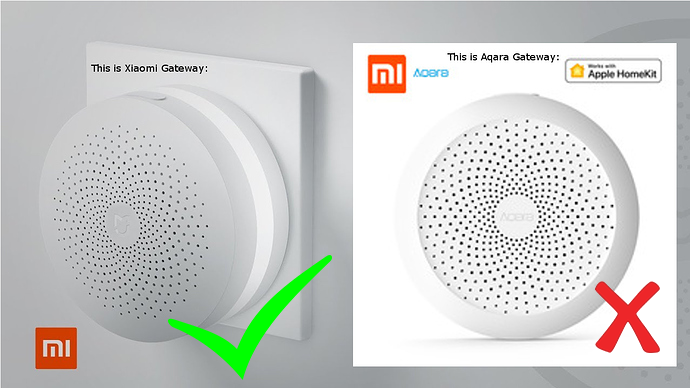
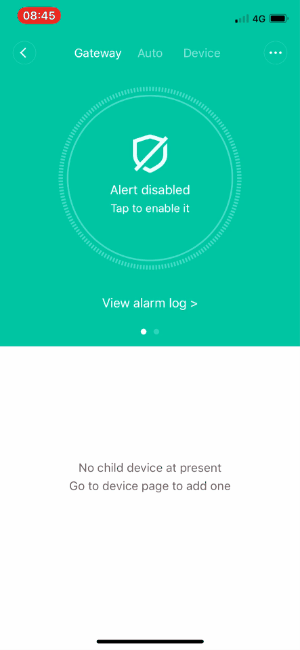

Présentation XiaomiTalk
=======================

Ce plugin permet de faire parler vos passerelles xiaomi Mijia.

>Attention, ce plugin est compatible avec la version xiaomi Mijia de la passerelle et PAS la version HomeKit (Aqara) !

Configuration du plugin 
=======================

Après installation du plugin, il vous suffit de l’activer. Si vous voullez aller plus vite, vous pouvez lancer les dépendances ou attendre ~5min.

Configuration des équipements 
=============================

La configuration des équipements xiaomiTalk est accessible à partir du menu
plugins puis Multimedia. Vous retrouvez ici :

-   un bouton pour chercher les passerelles sur votre réseau (pas de routage, même réseau obligatoire)

-   un bouton pour créer un équipement manuellement

-   un bouton pour afficher la configuration du plugin

-   un bouton qui vous donne une vue d'ensemble de tous vos équipements

-   enfin en dessous vous retrouvez la liste de vos équipements

En cliquant sur un de vos équipements vous arrivez sur la page
configuration de votre équipement comprenant 2 onglets, équipement et
commandes.

**Onglet Equipement** :
-----------------------

-   **Nom de l’équipement** : Nom de votre équipement

-   **Activer** : Permet de rendre votre équipement actif

-   **Visible** : Le rend visible sur le dashboard

-   **Objet parent** : Indique l’objet parent auquel appartient l’équipement

-   **Ip de la passerelle** : L'ip de la passerelle en question

-   **Token** : Token (et pas Password) de la passerelle. Ainsi que la possiblité de vérifier s'il est correct.

-   **Volume par défaut** : Le volume est un pourcentage (sans le signe pourcent). Utilisé si le champ Options ne donne pas d'autre information.
-   **Langue par défaut** : La langue a utiliser si le champ Options ne donne pas d'autre information.
-   **Jingle par défaut** : Choisir le jingle qui doit être joué avant le message. Utilisé si le champ Options ne donne pas d'autre information.
-   **Système de TTS par défaut** : GoogleTTS est recommandé. Utilisé si le champ Options ne donne pas d'autre information.

**Onglet Commandes** :
----------------------

Il existe une seule commande **Parle**. Elle contient deux champs, un champ Options et un Message.

**Utilisation du Widget ou dans un Scénario** :
-----------------------------------------------

Exemple d'options pour le champ Options : *volume=10,jingle=non,tts=picotts,lang=en_US*
>**Important** : Les options doivent être séparées par des virgules sans importance d'ordre. Aucune option n'est obligatoire, si elle n'est pas présente, la valeur de l'équipement sera utilisée.

Champ *Options* - choix valides :
-	**volume=** pourcentage du volume, valeur comprise entre *0* et *100* (sans le signe %).
-	**jingle=** *oui* ou *non* pour utiliser le jingle par défaut (ou pas) ou *sncf*, sinon des valeurs entre *10-13* pour les sons intégrés à la passerelle.
-	**tts=** choisir entre *picotts* (pas compatible mini+ ou rPI1/2) ou *googletts* (Recommandé) ou *jeedom* (Expérimental) ou *osx* (via SSH) ou *voicerss* (Besoin d'une clé API) ou *ttswebserver*.
-	**lang=** choisir parmis les langues suivantes : *fr_FR* ou *en_US* ou *en_GB* ou *de_DE* ou *es_ES* ou *it_IT*.
- **voix=** si *tts=osx* alors choisir parmis les voix suivantes : Thomas ou Aurelie ou Audrey (si installées)  (testé sur Mojave)
- **voix=** si *tts=ttswebserver* alors choisir parmis les voix listées dans l'interface (dépendant de ce que vous avez installé)

>Sous Debian Jessie (deb8), les messages qui font plus de 100 caractères et qui utilisent *googletts* passeront en *picotts* à cause d'une limitation de *avconv* (le convertisseur audio). Sous Debian Stretch (deb9), ces messages seront fractionnés en parties de 100 caractères et joués à la suite pour votre plus grand plaisir !

Champ *Message* : Ecrivez le texte qui doit être prononcé par votre passerelle.

>Pour *tts=osx* vous devez avoir activé SSH sur votre mac dans Préférences système > Partages > Sessions Distantes et vérifiez que vous avez bien activé toutes les voix Personnalisées de votre langue dans Préférences système > Accessibilité > Parole  (testé sur Mojave)

>Pour *tts=voicerss* vous avez besoin d'une clé API (gratuite pour moins de 350 TTS/jour) : http://www.voicerss.org/login.aspx
